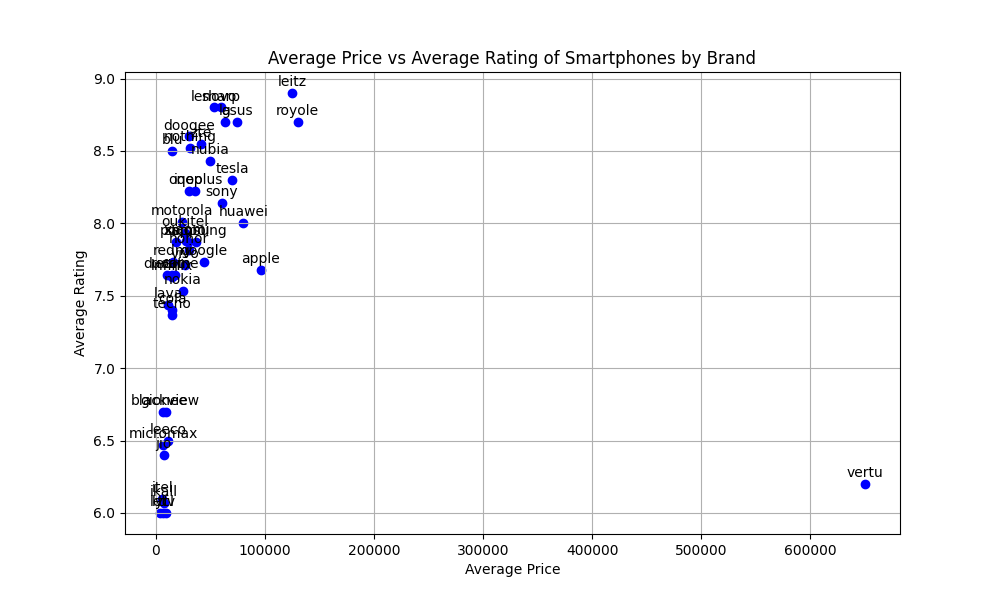
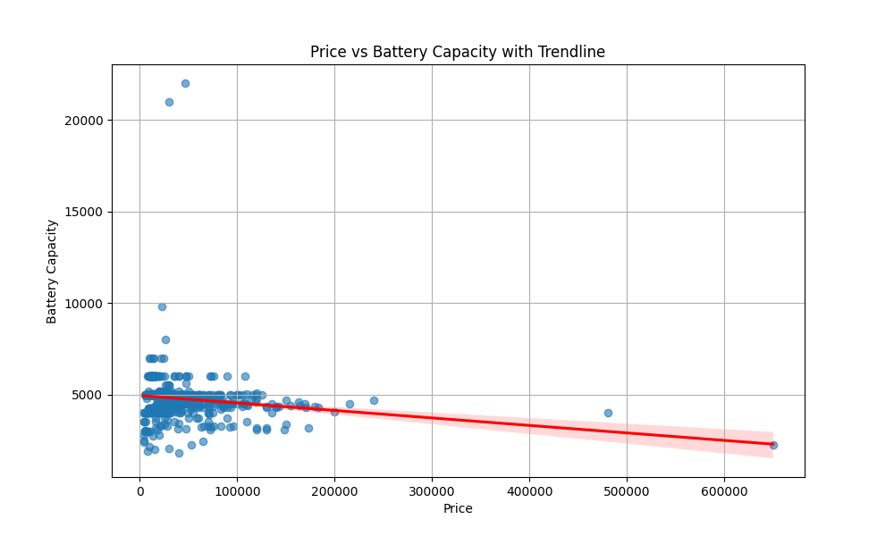

# Executive Report on Mobile Device Specifications Analysis

## Executive Summary
This report presents a comprehensive analysis of a dataset containing specifications and pricing information for various mobile devices. The analysis focuses on two primary questions: the relationship between smartphone prices and their average ratings, and the variation of battery capacities across different price ranges. Key insights reveal a weak correlation between price and ratings, as well as a complex relationship between price and battery capacity. Recommendations are provided to guide market analysis and consumer decision-making.

## Dataset Description
The dataset falls under the **technology** domain, specifically within the **mobile device specifications** category. It includes detailed specifications and pricing information for various mobile devices, encompassing:

- Brand names
- Models
- Prices
- Ratings
- Technical specifications (e.g., processor details, battery capacity, camera specifications)

This dataset serves multiple use cases, including market analysis for mobile devices, comparative analysis of smartphone features and pricing, and consumer decision support for purchasing smartphones.

## Analysis Questions and Answers

### 1. What is the average price of smartphones across different brands, and how does this correlate with their average ratings?
#### Summary of Insights
The analysis of smartphone data reveals the following key insights:

#### Average Price and Rating by Brand
The table below shows the average price and average rating for each smartphone brand:

| Brand      | Average Price (USD) | Average Rating |
|------------|---------------------|----------------|
| vertu      | $650,000.00         | 6.20           |
| leitz      | $124,990.00         | 8.90           |
| lenovo     | $53,494.50          | 8.80           |
| lg         | $63,329.33          | 8.70           |
| asus       | $74,709.43          | 8.70           |
| google     | $44,332.57          | 7.73           |
| ...        | ...                 | ...            |

#### Correlation Between Price and Rating
The correlation coefficient between average price and average rating is **-0.0346**, indicating a very weak negative correlation. This means that, on average, as the price of smartphones increases, the average rating slightly decreases, but this relationship is not strong.

#### Key Findings
- **Highest Average Price:** The brand with the highest average price is **vertu** at $650,000.00.
- **Highest Average Rating:** The brand with the highest average rating is **leitz** at 8.90.
- **Lowest Average Price:** The brand with the lowest average price is **lyf** at $3,940.00.
- **Lowest Average Rating:** The brand with the lowest average rating is **itel** at 6.10.

#### Conclusion
The data suggests that there is no significant relationship between the price of smartphones and their ratings. While some premium brands like **vertu** and **leitz** have very high prices and ratings, other brands like **google** and **realme** offer competitive ratings at more affordable price points.

As shown in the visualization below, the relationship between average price and average rating is illustrated:

---

### 2. How do the battery capacities of smartphones vary by price range, and what visual trends can be identified in this relationship?
#### Summary of Insights
The analysis of smartphone battery capacities in relation to price ranges reveals several key insights:

1. **Correlation Between Price and Battery Capacity**: The correlation coefficient of approximately **-0.159** indicates a weak negative correlation. This suggests that as the price increases, battery capacity tends to decrease slightly, but this relationship is not strong.

2. **Scatter Plot and Trendline**: The scatter plot shows a general upward trend, suggesting that higher-priced smartphones might have higher battery capacities. However, the trendline, which shows a positive slope, seems to contradict the correlation coefficient. This discrepancy suggests that while there's a slight positive trend, it's not statistically significant.

3. **Mean and Median Battery Capacities**:
   - **Low Price Range**: Mean ~4886 mAh, Median 5000 mAh
   - **Medium Price Range**: Mean ~4970 mAh, Median 5000 mAh
   - **High Price Range**: Mean ~4810 mAh, Median 4800 mAh
   - **Premium Price Range**: Mean ~4600 mAh, Median ~4526 mAh

4. **Box Plot Analysis**: The box plot shows that higher price ranges generally have higher median battery capacities. However, there is significant overlap between the price ranges, particularly between medium, high, and premium ranges, indicating variability within each category.

#### Summary
While there is a slight tendency for higher-priced smartphones to have higher battery capacities, this relationship is weak and inconsistent. The data shows variability within each price range, and the correlation between price and battery capacity is not strong. Therefore, battery capacity alone is not a reliable indicator of smartphone price.

The scatter plot illustrating the relationship between price and battery capacity is shown below:

The trendline visualization is as follows:

The box plot showing battery capacity distribution across price ranges is displayed below:

---

## Key Insights and Recommendations
- **Weak Correlation**: The weak correlation between price and ratings suggests that consumers should not rely solely on price as an indicator of quality. Brands like **google** and **realme** provide good ratings at lower price points.
  
- **Battery Capacity Variability**: The variability in battery capacities across price ranges indicates that consumers should consider battery specifications alongside price when making purchasing decisions.

- **Market Positioning**: Brands should focus on enhancing features that improve ratings without necessarily increasing prices, as higher prices do not guarantee better ratings.

- **Consumer Education**: Educating consumers on the nuances of smartphone specifications, including the relationship between price, ratings, and battery capacity, can aid in more informed purchasing decisions.

This analysis provides valuable insights for stakeholders in the mobile device market, enabling better strategic decisions and improved consumer support.